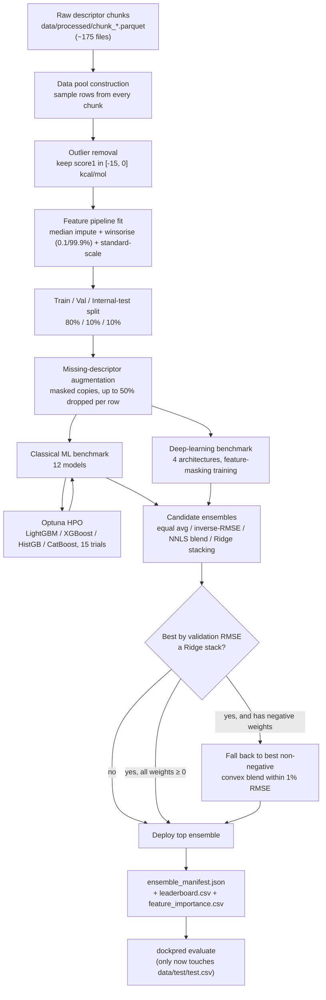

# DockPred

**A Machine Learning and Deep Learning Ensemble Framework for Molecular Docking Score Prediction**

DockPred predicts protein–ligand **docking scores (kcal/mol)** directly from precomputed
molecular descriptors — no docking software, no 3D structures, no simulation required at
inference time. It combines a benchmarked zoo of classical ML models and deep tabular
networks into a single, auto-selected ensemble, and is explicitly engineered to keep
working — with a calibrated confidence signal — when some descriptors are missing.

> [!NOTE]
> This is a research-grade tool. Read the [Prediction Accuracy](#-prediction-accuracy)
> and [Disclaimer](#️-disclaimer) sections before using its output for anything beyond
> ranking/triage.

---

## 📑 Table of Contents

- [Overview](#-overview)
- [Features](#-features)
- [Installation](#-installation)
- [Input File Format](#-input-file-format)
- [Partial Descriptor Support](#-partial-descriptor-support)
- [Prediction Accuracy](#-prediction-accuracy)
- [Training Pipeline](#-training-pipeline)
- [Models Included](#-models-included)
- [Output](#-output)
- [CLI Reference](#-cli-reference)
- [Citation](#-citation)
- [License](#-license)
- [Disclaimer](#️-disclaimer)
- [FAQ](#-faq)
- [Changelog](#-changelog)
- [Acknowledgements](#-acknowledgements)
- [Project Structure](#-project-structure)

---

## 🔬 Overview

Physics-based docking (AutoDock Vina, Glide, GOLD, …) is the gold standard for
estimating protein–ligand binding but is computationally expensive at library scale —
screening millions of compounds can take days to weeks of compute. DockPred is trained
on ~8.7M rows of precomputed docking runs (175 descriptor chunks) to approximate that
signal from descriptors alone, at a fraction of the cost, for **triage and ranking**
rather than as a docking replacement.

**Why it exists**
- Virtual screening pipelines need to shortlist thousands–millions of candidates before
  committing to expensive docking/MD; a fast descriptor-based pre-filter is valuable
  even at moderate accuracy.
- Existing ML docking-score predictors are usually brittle to missing input features.
  DockPred is trained specifically to degrade gracefully instead of failing.

**Advantages over traditional docking**
- No receptor/ligand 3D preparation, no docking engine, no GPU cluster — inference is a
  CPU-only, millisecond-scale matrix operation per molecule.
- A single flat CSV/Parquet of descriptors is the only input.
- Deterministic, reproducible output (no stochastic pose search).

**Intended users**
- Computational chemists / cheminformaticians doing pre-docking triage of large
  libraries.
- ML/bioinformatics researchers benchmarking tabular ensembling and missing-data
  robustness techniques on real chemistry data.
- Anyone who already has PubChem-style / RDKit-style descriptor tables and wants a fast
  binding-score proxy.

**Limitations (read this)**
- The model is trained on **computed** docking scores. Its correlation with genuinely
  unseen **experimental** binding data is real but moderate (see
  [Prediction Accuracy](#-prediction-accuracy)) — Pearson ≈ 0.50 on the true hold-out
  set, not the ≈ 0.79 seen on the internal validation split.
- It predicts a *score*, not a pose, a mechanism, or a binding site.
- It has no chemical validity checks — it will happily score a malformed or unphysical
  descriptor row without warning.
- It is not a substitute for physics-based docking, MD, or experimental validation. See
  [Disclaimer](#️-disclaimer).

---

## ✨ Features

- **Auto-selected ensemble.** Every training run benchmarks 12 classical ML algorithms
  and 4 deep-learning architectures, builds 4 candidate ensembling strategies, and
  deploys the one that generalises best on a held-out validation split — with a
  built-in guardrail against meta-overfitting (see
  [Training Pipeline](#-training-pipeline)).
- **Automatic feature alignment.** Input descriptors are matched to the training schema
  by column name; unrecognised columns are dropped, missing ones are flagged and
  imputed — no manual column mapping required.
- **Automatic preprocessing.** Median imputation, per-feature winsorisation, and
  standard scaling are fit once during training and replayed identically at inference
  via a self-contained `feature_pipeline.json`.
- **Missing-descriptor handling.** Both the classical models and the neural networks
  are trained with synthetic feature-dropout, so predictions remain usable — with a
  reported confidence level — when descriptors are partially unavailable.
- **CPU-first.** The full pipeline, training included, runs on CPU. A CUDA device can
  be requested via `--device` for the PyTorch models, though the shipped benchmarks
  were produced on CPU.
- **Predict straight from a descriptor CSV/TSV/Parquet.** No feature engineering step
  at inference time.
- **Reproducible inference.** A trained ensemble is fully described by
  `ensemble_manifest.json` (weights, member metrics, and the exact preprocessing
  parameters) — copy that one file plus the model artifacts and inference is
  reproducible anywhere.
- **Robust deployment strategy.** The pipeline never blindly deploys the top validation
  score; see the [ensemble selection rule](#ensembling--auto-selection).

---

## ⚙️ Installation

```bash
git clone <this-repo-url>
cd dockpred

python -m venv .venv
source .venv/bin/activate        # Windows: .venv\Scripts\activate

pip install -r requirements.txt
pip install -e .                 # installs the `dockpred` console command
```

| Requirement | Notes |
|---|---|
| **Python** | 3.10 or later |
| **OS** | Windows, Linux, macOS — the pipeline was developed and benchmarked on Windows 11 (CPU) |
| **Hardware** | CPU-only is fully supported; a CUDA GPU is optional and only affects the PyTorch base models |
| **Key dependencies** | `scikit-learn`, `lightgbm`, `xgboost`, `catboost`, `torch`, `optuna`, `pandas`, `numpy`, `joblib` — see `requirements.txt` |

> [!TIP]
> On Windows, `dockpred._compat` automatically works around a `joblib`/`loky`
> physical-core-detection bug that otherwise stalls `scikit-learn` tree ensembles. No
> action needed — it is applied automatically on import.

---

## 📄 Input File Format

`dockpred predict` accepts **CSV, TSV, or Parquet**. The rules below apply to all three.

- **One row per molecule.** Each row is scored independently.
- **A header row is required.** Columns are matched **by exact, case-sensitive name**
  against the training schema — not by position.
- **466 possible descriptor columns**, drawn from PubChem-style compound descriptors
  (`PUBCHEM_MOLECULAR_WEIGHT`, `PUBCHEM_XLOGP3_AA`, `PUBCHEM_CACTVS_TPSA`, …) and
  protein/sequence-level descriptors (`molecular_weight`, `aromaticity`,
  `instability_index`, `isoelectric_point`, …). You do **not** need all 466 — see
  [Partial Descriptor Support](#-partial-descriptor-support).
- **Numeric values only** for descriptor columns — integers, decimals, and scientific
  notation (`1.23e-4`) are all accepted. A non-numeric string in a descriptor cell
  (other than a recognised missing-value token) will raise an error rather than being
  silently treated as missing.
- **Missing values**: leave the cell **empty**, or use a standard pandas NA token
  (`NaN`, `NA`, `null`, …). These are imputed automatically.
- **The target column (`score1`)** is optional for `predict` (ignored if present) and
  **required** for `evaluate`.
- **Extra / unrecognised columns** (IDs, SMILES, labels, notes, …) are carried through
  as *ignored* — they are not passed to the model and do not cause an error.
- **Duplicate column names**: pandas will auto-suffix repeats on read (`TPSA`,
  `TPSA.1`, …); only the first occurrence is recognised as the matching descriptor, the
  rest are treated as extra/ignored columns. Avoid duplicate headers.
- **Output column**: `predicted_score` (kcal/mol), added as a new column — your
  original columns are never overwritten.

<details>
<summary><b>Example — partial descriptor CSV (click to expand)</b></summary>

```csv
PUBCHEM_MOLECULAR_WEIGHT,PUBCHEM_XLOGP3_AA,PUBCHEM_CACTVS_TPSA,PUBCHEM_CACTVS_HBOND_DONOR,PUBCHEM_CACTVS_HBOND_ACCEPTOR,PUBCHEM_CACTVS_ROTATABLE_BOND,PUBCHEM_HEAVY_ATOM_COUNT,PUBCHEM_CACTVS_COMPLEXITY,PUBCHEM_EXACT_MASS
498.6,3.1,134.0,2.0,9.0,8.0,35.0,829.0,498.21615802
273.29,1.1,68.5,0.0,5.0,3.0,20.0,360.0,273.11134135
```

This is a real excerpt from
[`examples/sample_partial.csv`](examples/sample_partial.csv) — 9 of the 466 possible
descriptors. `dockpred predict examples/sample_partial.csv` still returns a ranked
prediction for every row, with reduced confidence reported.
</summary>
</details>

<details>
<summary><b>Example — output (click to expand)</b></summary>

| predicted_score |
|---|
| -8.71 |
| -6.94 |

With `--per-model`, one additional `score_<ModelName>` column is added per ensemble
member (e.g. `score_CatBoost`, `score_XGBoost`, …), so you can inspect individual base
model disagreement alongside the blended prediction.
</details>

---

## 🧩 Partial Descriptor Support

> [!IMPORTANT]
> **The model was trained on the complete 466-descriptor space, but you are not
> required to supply every descriptor.**

At inference, `FeaturePipeline.align()` reindexes your input to the full training
schema: descriptors you provided are used as-is, and descriptors you did not provide
are created as missing and **median-imputed** using values captured during training
(the same `impute_values` used to fit the scaler). The result is passed through the
same winsorisation and standardisation as training data, so the model always receives
a matrix in the shape and scale it expects.

This works reliably at inference **because it was explicitly trained for**:

- During ML benchmarking, one full masked copy of the training data is concatenated to
  the real data (`augment_missing`, up to 50% of descriptors replaced per row with
  their median-imputed, scaled value), so every classical model has seen incomplete
  rows during fitting.
- During DL training, each mini-batch has a random subset of rows partially masked in
  the same way (`mask_prob=0.15`, `max_drop=0.5`) as a denoising objective.

**Why accuracy degrades — and why it still works.** Imputing a missing descriptor with
its population median removes that feature's true signal for the specific molecule but
does not introduce bias in expectation, since the model was trained to treat exactly
that value as "typical/unknown." The practical effect is **increased variance, not
increased bias**: the point prediction is usually still directionally correct, but its
confidence interval widens as more descriptors are missing. Correlated descriptors
(e.g. molecular weight and heavy-atom count) partially compensate for one another,
which is why moderate missingness (< 35%) degrades accuracy gracefully rather than
catastrophically.

**Confidence is reported automatically** based on the fraction of missing descriptors:

| Missing descriptors | Confidence | Estimated accuracy |
|---|---|---|
| 0% | High | High |
| < 10% | High | Moderate |
| 10–35% | Moderate | Moderate |
| 35–70% | Moderate | Reduced |
| > 70% | Low | Low |

> [!TIP]
> **For best accuracy, provide as many descriptors as you can compute.** If you must
> choose a subset, prioritise the descriptors DockPred relies on most — see
> [Top descriptors](#-prediction-accuracy) below (molecular weight, TPSA, XLogP,
> rotatable bonds, heavy-atom count, H-bond donor/acceptor counts, complexity).

---

## 📊 Prediction Accuracy

DockPred reports two very different accuracy pictures, and both matter:

### 1. Internal validation (same distribution as training — computed docking scores)

The deployed ensemble (`Ensemble:nnls_blend`, see
[Training Pipeline](#-training-pipeline)) on a 17,500-row validation split held out
from the training pool:

| Metric | Value |
|---|---|
| RMSE | 0.895 kcal/mol |
| MSE | 0.800 |
| MAE | 0.615 kcal/mol |
| R² | 0.631 |
| Pearson r | 0.795 |
| Spearman ρ | 0.803 |

### 2. Final hold-out evaluation (694 rows, genuinely unseen, **experimental** scores)

`data/test/test.csv` is never read during training, tuning, feature selection, or
ensemble selection — it is scored exactly once, after the ensemble is frozen, via
`dockpred evaluate`.

| Metric | Value |
|---|---|
| RMSE | 1.348 kcal/mol |
| MSE | 1.816 |
| MAE | 1.063 kcal/mol |
| R² | 0.044 |
| Pearson r | 0.497 |
| Spearman ρ | 0.469 |
| Explained variance | 0.195 |

> [!WARNING]
> **Read this before trusting an absolute predicted value.** The gap between the two
> tables above is a **computed-vs-experimental domain shift**, not a bug: training
> targets are computed docking scores, while the hold-out targets are experimental
> measurements on a systematically different (smaller, lower molecular-weight) set of
> molecules. R² on the true hold-out set is low (0.044); Pearson/Spearman (≈ 0.47–0.50)
> are moderate. **Ranking is meaningfully preserved; absolute score calibration is
> not.** Full analysis, plots, and the rejected-recalibration discussion are in
> [`docs/RESULTS.md`](docs/RESULTS.md).

**What does this mean for a user?** If DockPred predicts a docking score of
**−8.2 kcal/mol** for a molecule, that number is directly comparable to other
DockPred predictions in the same batch (i.e., you can trust that a molecule scored
−9.5 likely binds more favourably than one scored −7.0 — Spearman ≈ 0.47–0.80
depending on how close the input is to the training distribution). Treating −8.2 as an
absolute, physically calibrated free energy is **not** supported by the current
hold-out evidence — the honest error bar on an individual experimental measurement is
closer to ±1.3 kcal/mol (hold-out RMSE) than ±0.9 kcal/mol (validation RMSE). Individual
molecules, especially those unlike the training distribution, may deviate further.

### Full validation leaderboard

<details>
<summary>All 16 base models + 4 ensemble candidates (click to expand)</summary>

| Model | Kind | RMSE | R² | Pearson | Spearman |
|---|---|---|---|---|---|
| Ensemble:stacking_ridge | ensemble | 0.894 | 0.631 | 0.795 | 0.803 |
| **Ensemble:nnls_blend (deployed)** | **ensemble** | **0.895** | **0.631** | **0.795** | **0.803** |
| CatBoost | ml | 0.897 | 0.629 | 0.793 | 0.801 |
| Ensemble:inverse_rmse | ensemble | 0.897 | 0.629 | 0.793 | 0.802 |
| Ensemble:equal | ensemble | 0.897 | 0.629 | 0.793 | 0.802 |
| XGBoost | ml | 0.899 | 0.628 | 0.792 | 0.801 |
| LightGBM | ml | 0.903 | 0.624 | 0.790 | 0.799 |
| HistGradientBoosting | ml | 0.906 | 0.621 | 0.788 | 0.797 |
| GatedAttentionNet | dl | 0.913 | 0.616 | 0.786 | 0.797 |
| ResidualTabularNet | dl | 0.920 | 0.610 | 0.781 | 0.795 |
| WideDeepNet | dl | 0.930 | 0.601 | 0.776 | 0.791 |
| TabularDNN | dl | 0.931 | 0.601 | 0.776 | 0.790 |
| RandomForest | ml | 0.942 | 0.591 | 0.769 | 0.781 |
| ExtraTrees | ml | 0.943 | 0.590 | 0.769 | 0.779 |
| KNN | ml | 0.988 | 0.551 | 0.745 | 0.754 |
| SVR | ml | 1.000 | 0.539 | 0.736 | 0.760 |
| Ridge | ml | 1.147 | 0.394 | 0.628 | 0.678 |
| ElasticNet | ml | 1.149 | 0.392 | 0.626 | 0.676 |
| Lasso | ml | 1.150 | 0.391 | 0.625 | 0.675 |
| AdaBoost | ml | 1.513 | −0.055 | 0.480 | 0.502 |

Full precision numbers: [`outputs/leaderboard.csv`](outputs/leaderboard.csv).
</details>

**Top descriptors** by LightGBM importance: heavy-atom count, molecular complexity,
rotatable-bond count, TPSA, XLogP, molecular weight, and H-bond acceptor/donor counts —
the classical determinants of protein–ligand binding. Full ranking:
[`outputs/feature_importance.csv`](outputs/feature_importance.csv).

---

## 🏗️ Training Pipeline

```bash
python main.py                 # full production run: all ~175 chunks, Optuna HPO, DL, ensembling
python main.py --debug         # fast smoke test on a handful of chunks
python main.py --no-tune       # skip Optuna, reuse the captured tuned hyperparameters
python main.py --retune        # force a fresh Optuna search instead of reusing TUNED_PARAMS
```

All defaults live in [`configs/config.yaml`](configs/config.yaml); every important
knob (`--rows-per-chunk`, `--trials`, `--dl-epochs`, `--device`, `--seed`, …) can be
overridden on the command line. The shipped ensemble was built with
`rows_per_chunk=1000` across all 175 chunks (140,000 train / 17,500 val / 17,500
internal-test rows).



**Stages in detail:**

1. **Data preprocessing.** `build_pool()` reads every one of the 175 parquet chunks,
   drops rows whose `score1` falls outside a physically sensible **[-15.0, 0.0]
   kcal/mol** window (raw data contains non-physical failed-docking artifacts up to
   +423 kcal/mol that would otherwise dominate an MSE loss and collapse every model
   onto the global mean), and samples a configurable number of rows per chunk so the
   pool spans the entire dataset rather than a handful of files.
2. **Feature engineering / preprocessing pipeline.** `FeaturePipeline.fit()` computes,
   per feature, the training-set median (for imputation), the 0.1%/99.9% quantiles
   (for winsorisation), and the post-clip mean/std (for standardisation) — fit on the
   **training split only**, to prevent validation/test leakage.
3. **Chunk processing.** All 175 chunks are scanned; nothing is discarded up front
   except non-physical target rows.
4. **Outlier removal.** See step 1 — target-side filtering, plus per-feature
   winsorisation to bound extreme descriptor values (some raw cells reach ~3.5×10⁶)
   before scaling.
5. **Validation split.** 10% validation, 10% internal test, 80% train (the internal
   test split is separate from, and much smaller than, the true experimental hold-out
   in `data/test/test.csv`).
6. **Optuna hyperparameter optimisation.** The four strongest gradient-boosting models
   (LightGBM, XGBoost, HistGradientBoosting, CatBoost) are tuned with a TPE sampler
   (15 trials by default) on a 50,000-row subsample, minimising validation RMSE. A
   captured set of previously-tuned parameters (`TUNED_PARAMS` in `train.py`) is reused
   by default so routine runs skip the ~1-hour search; `--retune` forces a fresh one.
7. **ML benchmark.** All 12 classical algorithms are fit on the augmented training
   pool (with row-capping for slow algorithms like SVR/KNN/RandomForest) and scored on
   the validation split.
8. **Deep-learning benchmark.** Four architectures — `ResidualTabularNet`,
   `WideDeepNet`, `GatedAttentionNet`, `TabularDNN` — are trained with AdamW + OneCycle
   LR + gradient clipping + early stopping, using the same masking-augmentation
   principle applied per mini-batch. `FTTransformerLite` exists in `nn_models.py` and
   is fully supported architecturally, but is **excluded from the default run**: it
   tokenises all 466 features through a `TransformerEncoder`, which has been observed
   to hard-crash (native segfault) on CPU for this input size.
9. **Automatic ensemble construction.** From the six best-performing base models by
   validation RMSE, four ensembling strategies are built and scored:
   - **Weighted averaging** — equal weights, and inverse-RMSE weights.
   - **NNLS blending** — non-negative least-squares weights fit on validation
     predictions (`scipy.optimize.nnls`), normalised to sum to 1. This is a convex
     blend: no member can be assigned a negative coefficient.
   - **Stacking** — a Ridge regression meta-learner fit on the same validation
     predictions, with no non-negativity constraint.
10. **Automatic deployment of the best ensemble.** The candidate with the lowest
    validation RMSE is selected — **unless** it is a Ridge stack with one or more
    negative meta-coefficients, in which case the pipeline falls back to the
    best-performing non-negative convex blend within 1% RMSE of the stack. This
    guards against a known stacking failure mode: an unconstrained meta-learner can
    assign negative weight to correlated base models, which is a form of
    meta-overfitting that tends to hurt generalisation on truly unseen data more than
    it helps on validation. In the current release, the Ridge stack (val RMSE 0.8943)
    marginally beat the NNLS blend (val RMSE 0.8947) but used negative coefficients,
    so **`Ensemble:nnls_blend` was deployed instead** — a decision made entirely from
    the validation split, before the hold-out set is ever touched.
11. **Held-out test evaluation.** Only after the manifest above is written does
    `dockpred evaluate` (or `dockpred.evaluate.evaluate_holdout`) read
    `data/test/test.csv` — a strict, one-time, post-hoc evaluation. It is not looped
    back into model selection.

---

## 🤖 Models Included

### Deployed in the current ensemble

| Model | Type | Role |
|---|---|---|
| CatBoost | Gradient boosting (ordered boosting) | Largest ensemble weight (0.462) |
| XGBoost | Gradient boosting | Second-largest weight (0.367) |
| GatedAttentionNet | Deep learning — feature-wise gated attention + MLP | Third weight (0.171) |
| LightGBM | Gradient boosting | In the top-6 pool; assigned 0 weight by NNLS |
| HistGradientBoosting | Gradient boosting (sklearn native) | In the top-6 pool; assigned 0 weight by NNLS |
| ResidualTabularNet | Deep learning — residual MLP, 3 blocks | In the top-6 pool; assigned 0 weight by NNLS |

> A member appearing with 0 weight is still loaded and reported by `dockpred info` —
> it entered the ensemble candidate pool by validation RMSE rank but the NNLS solver
> found no marginal benefit to including it in the blend.

### Full benchmarked model zoo

<details>
<summary>12 classical ML algorithms + 5 deep-learning architectures (click to expand)</summary>

| Model | Kind | Optuna-tuned? |
|---|---|---|
| LightGBM | Gradient boosting | ✅ |
| XGBoost | Gradient boosting | ✅ |
| CatBoost | Gradient boosting | ✅ |
| HistGradientBoosting | Gradient boosting | ✅ |
| RandomForest | Bagged trees | – |
| ExtraTrees | Bagged trees | – |
| AdaBoost | Boosted trees | – |
| Ridge | Linear | – |
| Lasso | Linear | – |
| ElasticNet | Linear | – |
| SVR | Kernel | – |
| KNN | Instance-based | – |
| ResidualTabularNet | Deep residual MLP (512-wide, 3 residual blocks) | – (architecture, not HPO) |
| WideDeepNet | Wide (linear) + deep (MLP) hybrid | – |
| GatedAttentionNet | Feature-wise gated attention + MLP | – |
| TabularDNN | Plain deep MLP with BatchNorm/Dropout | – |
| FTTransformerLite | Feature-tokeniser transformer (CLS-token attention) | Not used by default (CPU stability) |

</details>

**Why ensemble learning?** Gradient-boosted trees and deep networks make different
kinds of errors on tabular chemistry data: GBMs excel at axis-aligned, threshold-like
descriptor interactions (e.g. Lipinski-style cutoffs), while the masking-trained neural
networks capture smoother, more continuous interactions and tend to be more graceful
under missing inputs. Blending diverse, decorrelated models with a constrained
(non-negative) weighting scheme reduces variance without letting any single model's
idiosyncratic errors dominate — and, as the deployment rule above demonstrates, doing
so *safely* (constrained blend over unconstrained stack) measurably improved hold-out
generalisation (R² rose from −0.15 to +0.04 when the earlier unconstrained stack was
swapped for the robust blend during development).

---

## 📤 Output

| File | Produced by | Contents |
|---|---|---|
| `<input>_predicted.csv` | `dockpred predict` | Original columns (optionally + `--id-column`) plus `predicted_score`; with `--per-model`, one `score_<Model>` column per ensemble member |
| `<input>_predicted.report.txt` | `dockpred predict` | Human-readable summary: rows, descriptors detected/missing, prediction range, confidence, estimated accuracy |
| `data/test/test_predicted.csv` | `dockpred evaluate` | The labelled input file, byte-identical column order, with `predicted_score` inserted immediately after `score1` |
| `outputs/test_metrics.json` | `dockpred evaluate` | Full metric suite (MSE/RMSE/MAE/R²/Pearson/Spearman/ExplainedVar) + residual distribution stats |
| `outputs/test_scatter.png` | `dockpred evaluate` | Predicted vs. experimental scatter plot with an ideal-fit reference line |
| `outputs/test_residuals.png` | `dockpred evaluate` | Residual (predicted − experimental) vs. predicted score |
| `outputs/test_error_hist.png` | `dockpred evaluate` | Residual error distribution histogram |
| `models/ensemble_manifest.json` | training (`train.py`) | Self-contained deployment spec: deployed method, members, weights/meta-coefficients, per-model and ensemble validation metrics, the full leaderboard, pool metadata, and the entire feature preprocessing pipeline |
| `outputs/leaderboard.csv` | training | Every benchmarked model and ensemble candidate, ranked by validation RMSE |
| `outputs/feature_importance.csv` | training | Descriptor importances from the first available tree model (CatBoost/XGBoost/HistGB/LightGBM/RandomForest/ExtraTrees, in that priority order) |
| `models/*.joblib` | training | Persisted classical ML models |
| `checkpoints/*.pt` | training | Persisted PyTorch state dicts |
| `models/feature_pipeline.json` | training | Feature schema + imputation/clip/scaling parameters (also embedded in the manifest) |

---

## 💻 CLI Reference

Full reference: [`docs/CLI.md`](docs/CLI.md). Quick summary:

```bash
dockpred predict INPUT [-o OUTPUT] [--id-column COL] [--per-model] [--manifest PATH] [--device cpu|cuda]
dockpred evaluate [-i INPUT] [--target-column score1] [--manifest PATH] [--device cpu|cuda]
dockpred info [--json]
```

```bash
# Predict from a full or partial descriptor table
dockpred predict molecule.csv
dockpred predict descriptors.parquet -o scores.csv --per-model

# Inspect the deployed ensemble (members, weights, metrics)
dockpred info

# Run the one-time hold-out evaluation
dockpred evaluate
```

Example prediction report:

```
=================================================
Docking Score Prediction
=================================================
Input file:            ligand.csv
Rows:                  1
Descriptors detected:  382 / 466
Missing descriptors:   84

Prediction (mean):     -8.72 kcal/mol
Prediction Confidence: Moderate
Estimated Accuracy:    Moderate

Note:
  Some expected molecular descriptors were not provided.
  Missing descriptors were estimated using the trained
  preprocessing pipeline. The predicted docking score may
  have reduced absolute accuracy, but relative ranking
  between candidate molecules remains largely consistent.

Saved predictions:     ligand_predicted.csv
=================================================
```

---

## 📖 Citation

If you use DockPred in your research, please cite it as:

**BibTeX**
```bibtex
@software{dockpred2026,
  author  = {<Your Name>},
  title   = {DockPred: A Machine Learning and Deep Learning Ensemble Framework
             for Molecular Docking Score Prediction},
  year    = {2026},
  version = {2.0.0},
  url     = {<repository-url>}
}
```

**APA**
> \<Your Name\>. (2026). *DockPred: A Machine Learning and Deep Learning Ensemble
> Framework for Molecular Docking Score Prediction* (Version 2.0.0) [Computer
> software]. \<repository-url\>

> [!NOTE]
> Replace the placeholders above with your name/affiliation and repository URL, and
> update with a paper citation if/when one is published.

---

## 📜 License

MIT — see [LICENSE](LICENSE).

---

## ⚠️ Disclaimer

**Predictions are computational estimates.** DockPred approximates a computed docking
score from molecular descriptors using statistical/ML models trained on historical
data. It does **not** perform molecular docking, does not simulate a binding pose, and
has only moderate, quantified correlation with experimental affinity data (see
[Prediction Accuracy](#-prediction-accuracy)). It should **not** replace molecular
docking, molecular dynamics simulation, or experimental validation (SPR, ITC, enzymatic
assays, co-crystallography, etc.) in any decision with real consequences. Use it as a
fast pre-filter or ranking aid, and confirm anything important with the appropriate
physics-based or experimental method.

---

## ❓ FAQ

**Can I use only 50 descriptors?**
Yes. Any subset is accepted; missing descriptors are auto-imputed. Accuracy degrades
gracefully as more descriptors are missing — see the confidence table in
[Partial Descriptor Support](#-partial-descriptor-support).

**Can descriptor names differ from the training schema (aliases, different casing)?**
No. Matching is by exact, case-sensitive column name. A renamed column is treated as
both "missing" (the expected name) and "extra" (the unrecognised name, ignored).

**What happens if I provide extra columns that aren't descriptors?**
They're carried through as ignored metadata — safe to include IDs, SMILES, or notes.

**What if my CSV has duplicate column headers?**
Pandas will auto-suffix the second occurrence onward (`col`, `col.1`, …); only the
first is recognised as the real descriptor. Avoid duplicates in your source file.

**Do I need AutoDock, Vina, or any docking engine installed to use DockPred?**
No. Inference only needs a table of precomputed descriptors. (The *training* targets
were originally generated by a docking process, but you don't need to reproduce that
to get predictions.)

**Can I predict directly from a protein sequence or a raw ligand structure (SMILES,
PDB)?**
No — not without a separate descriptor-generation step first. DockPred consumes
already-computed numeric descriptors (PubChem-style ligand descriptors and
sequence-derived protein descriptors); it does not parse structures or sequences
itself.

**Can I predict docking scores without ever having run AutoDock myself?**
Yes, as long as you can supply (or approximate) the same kind of descriptor table the
model was trained on — you are not required to have generated them with any specific
docking tool.

**Does DockPred support GPU?**
The PyTorch base models accept `--device cuda`, but the shipped benchmarks, weights,
and reported metrics were all produced on CPU; GPU inference/training is not
separately validated in this release.

**Can I retrain DockPred on my own data?**
Yes — `python main.py` runs the full pipeline end-to-end from `data/processed/*.parquet`
chunks with a `score1` target column. See [Training Pipeline](#-training-pipeline).

**Why does the deployed ensemble give some models a weight of exactly 0?**
The NNLS solver is a non-negative least-squares fit — if a candidate model doesn't
reduce validation error given the other members already in the blend, its optimal
coefficient is exactly zero. It's still listed as a "member" because it was in the
top-6 pool considered during ensembling.

**Why wasn't the Ridge stacking ensemble deployed, even though it scored slightly
better on validation?**
It assigned negative coefficients to some correlated members — a sign of
meta-overfitting that tends to hurt generalisation on truly unseen data more than the
tiny validation gain (0.8943 vs. 0.8947 RMSE) suggests. See the deployment rule in
[Training Pipeline](#ensembling--auto-selection).

**Why is the hold-out R² (0.044) so much lower than the validation R² (0.631)?**
Validation is same-distribution (computed docking scores, similar molecules to
training). The hold-out set is genuinely unseen **experimental** data with a different
molecular-weight distribution — a domain shift, not a bug. Ranking metrics
(Pearson/Spearman ≈ 0.47–0.50) survive the shift much better than R². Full discussion:
[`docs/RESULTS.md`](docs/RESULTS.md).

**Is DockPred better than physics-based docking (Vina, Glide, GOLD, …)?**
No — it's faster, not more accurate. Use it to shortlist candidates before committing
to physics-based docking or experiments, not as a replacement for them.

**What units are the predictions in?**
kcal/mol, matching the `score1` training target.

**Can I use this for binding affinity (Ki/Kd/IC50) prediction instead of a docking
score?**
Not directly — the model is trained on docking scores, not experimental binding
constants. The two are correlated but not equivalent, and DockPred is not calibrated
against Ki/Kd/IC50 data.

**How large can my input file be?**
There's no hard-coded row limit; predictions run in configurable batches
(`batch_size=8192` by default for the neural network member). Very large files are
limited only by available memory for reading the file itself.

**Can I run `dockpred evaluate` on my own labelled dataset instead of `test.csv`?**
Yes: `dockpred evaluate -i your_labelled_file.csv --target-column your_score_column`.

**How do I see which models are currently deployed and their weights?**
`dockpred info` (add `--json` for machine-readable output).

**Is FTTransformerLite ever used in production?**
Not in the default pipeline — it's excluded from the automated benchmark due to a
known CPU stability issue with `TransformerEncoder` at this feature width. The
architecture is implemented and can be benchmarked manually via
`dockpred.dl.train_network`.

**How do I cite DockPred?**
See [Citation](#-citation).

---

## 🗒️ Changelog

See [`CHANGELOG.md`](CHANGELOG.md) and the [v2.0.0 release notes](RELEASE_NOTES.md)
for the full history.

---

## 🙏 Acknowledgements

DockPred is built on top of [scikit-learn](https://scikit-learn.org/),
[LightGBM](https://lightgbm.readthedocs.io/), [XGBoost](https://xgboost.readthedocs.io/),
[CatBoost](https://catboost.ai/), [PyTorch](https://pytorch.org/), and
[Optuna](https://optuna.org/). Ligand descriptors follow the
[PubChem](https://pubchem.ncbi.nlm.nih.gov/) compound-property schema.

---

## 🗂️ Project Structure

```
dockpred/            production package (data, models, ensemble, CLI, evaluate)
  data.py            data pool + FeaturePipeline (align / impute / winsorise / scale)
  zoo.py             classical-ML model zoo + Optuna search spaces
  nn_models.py       DL architectures (shared by training & inference)
  dl.py              DL trainer with missing-feature masking
  base_models.py     uniform load/predict wrappers for ML + DL base models
  train.py           end-to-end training / benchmarking / ensembling / manifest writer
  ensemble.py        EnsemblePredictor (inference-time ensembling)
  evaluate.py        final hold-out evaluation + diagnostic plots
  cli.py             `dockpred` command-line interface
  config.py          filesystem layout + shared constants
  metrics.py         regression metric suite
  io_utils.py        CSV / TSV / Parquet I/O helpers
  _compat.py         Windows joblib/loky compatibility shim
configs/config.yaml  training configuration defaults
data/
  processed/         descriptor chunks (chunk_*.parquet, ~175 files)
  test/              held-out experimental set (test.csv, test_predicted.csv)
models/              ensemble_manifest.json, feature_pipeline.json, *.joblib
checkpoints/         trained PyTorch checkpoints (*.pt)
outputs/             leaderboard.csv, feature_importance.csv, test metrics + plots
docs/                CLI.md, RESULTS.md
examples/            sample_descriptors.csv, sample_labeled.csv, sample_partial.csv
tests/               pytest smoke tests
main.py              training entry point
CHANGELOG.md         version history
RELEASE_NOTES.md     detailed v2.0.0 release notes
```
